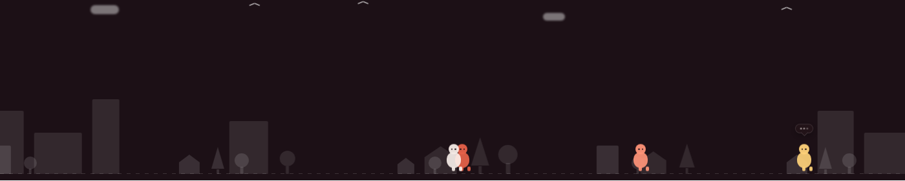
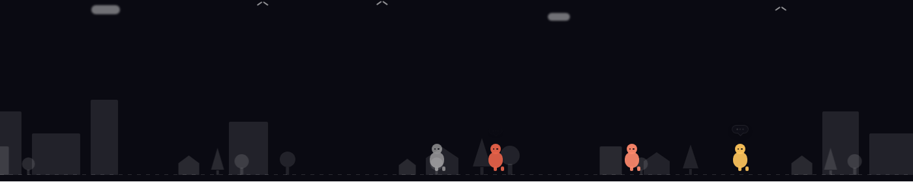
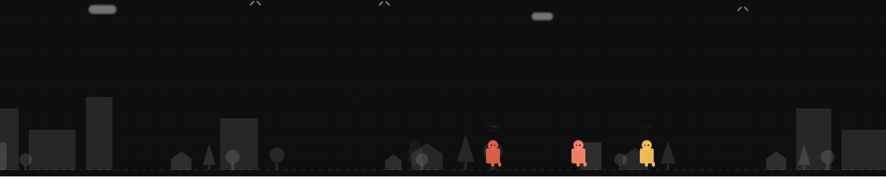
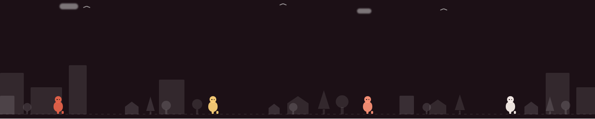
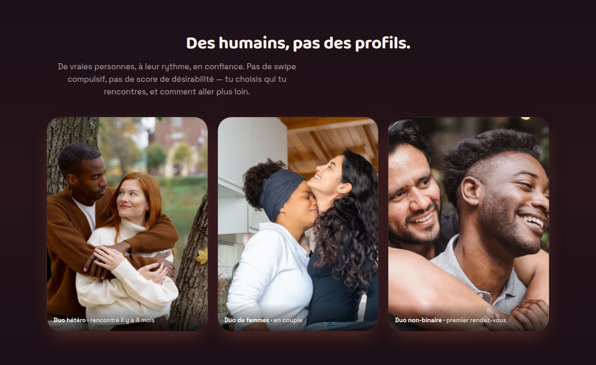
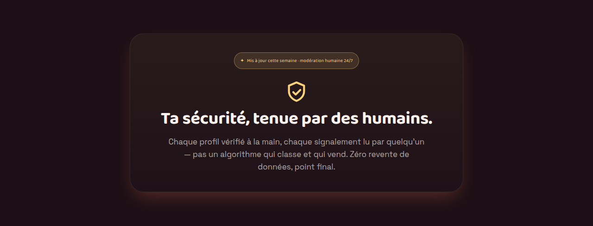
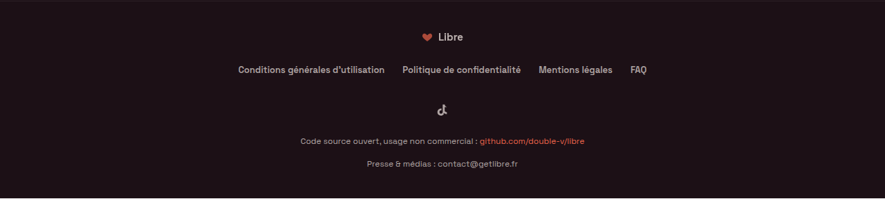

# Home « lobby » (épic [#243](https://github.com/double-v/libre/issues/243))

Refonte de la home publique à partir du prototype validé (Claude Design,
`templates/homepage-lobby`). **Depuis le cutover #250, `HomeLobby` EST la home
publique** (`src/app/page.tsx`, route `/`) : NAV + HERO + bandeau ambiant +
sections Humains/Sécurité/Closing + footer légal, sous le conteneur thémé du
foundation. `page.tsx` préserve le SEO sensible (metadata + canonical `www`,
`force-dynamic`, compteur `/api/stats/public`, jsonLd, `VersionWatcher`).

Trois thèmes de landing (`data-lobby` sur le conteneur racine, switcher no-flash) :
**cartoon** (défaut, plum-black chaud) · **arcade** · **retro** (8-bit). Ils sont
distincts des skins app `libre`/`libre-warm`. Voir `lobby-theme.ts`.

## Bandeau ambiant — `AmbientBand.tsx` ([#248](https://github.com/double-v/libre/issues/248))

Bandeau décoratif entre le hero et les sections du bas : petits personnages qui
marchent (bulles de dialogue), **skyline parallax** ville/campagne sur deux
couches, et **ciel** jour/coucher/nuit choisi selon l'heure (`getSky`, `auto` par
défaut). Purement décoratif → `aria-hidden="true"` + `pointer-events: none`.

Le corps des personnages est **arrondi** (blob) en cartoon/arcade et **carré**
(radius 3px) en retro — l'identité 8-bit passe par le token `[data-lobby='retro']`.
Les couleurs sont des tokens de thème (`--lobby-accent`/`--lobby-gold`/
`--lobby-accent-strong`/`--lobby-text`), jamais de hex inline.

| Thème | Aperçu (ciel de jour) |
|---|---|
| **cartoon** |  |
| **arcade** |  |
| **retro** (corps carrés) |  |

### Reduced-motion (garde-fou strict de l'épic)

Sous `prefers-reduced-motion: reduce`, **tout s'immobilise** : les personnages
sont figés à des positions réparties et stables (`staticLeft`), sans bulle,
skyline et étoiles statiques, aucune animation résiduelle. Le flag est détecté en
amont (`HomeLobby`, `matchMedia`) et passé en prop ; le bloc global
`prefers-reduced-motion` de `globals.css` sert de filet supplémentaire.

## Sections bas — Humains · Sécurité · Closing ([#249](https://github.com/double-v/libre/issues/249))

Trois sections statiques sous le bandeau, wrapper partagé `.lobby-section` +
variantes (`LobbyHumans` / `LobbySafety` / `LobbyClosing`). Titres en `h2`,
contraste AA sur les 3 thèmes, aucune animation propre (rien à figer en
reduced-motion). Aperçus en thème cartoon :

**Humains** — titre + chapô + 3 cartes récit (photo + légende en incrustation sur
voile sombre → contraste garanti). ⚠️ Photos = **placeholders** `/images/moment-*`
à re-sourcer (droits/consentement, cf. AC #249) ; `next/image` + `alt` honnête.

**Sécurité** — panneau centré, tag gold « modération humaine 24/7 » (en Press Start
2P sur le thème retro), bouclier SVG, titre + copy « zéro revente ».

**Closing** — accroche finale + CTA d'inscription (vrai lien `/register`, ≥ 52px).

**Footer** — `LobbyFooter` (#250) : la landing s'adresse à des visiteurs non
connectés, donc les liens légaux (CGU, confidentialité, mentions légales, FAQ) +
social + code source vivent ici (exception documentée à la règle app shell de
DESIGN.md). Landmarks `<nav aria-label>` + `<footer>`.

> Captures régénérables depuis `/` sur les 3 thèmes (switcher de la nav), avec et
> sans `prefers-reduced-motion` (les couleurs du ciel du bandeau dépendent de
> l'heure). Avant le cutover #250, la preview vivait sur `/lobby-preview`.
